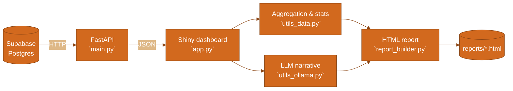
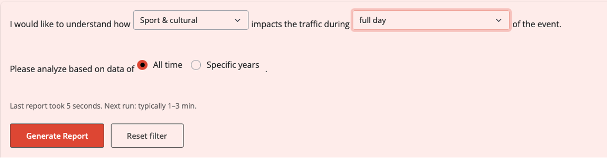

# 📄 Traffic-Predictor

Analyze how different **event categories** (e.g., *Sport & cultural*) relate to **traffic congestion**, then generate a shareable **HTML report** with charts and a short narrative summary.

## 📑 Table of Contents

- [📊 Overview](#-overview)
- [🏗️ System architecture](#️-system-architecture)
- [🧰 Installation](#-installation)
- [▶️ How to run](#️-how-to-run)
- [🔑 API requirements (keys & .env)](#-api-requirements-keys--env)
- [🗃️ Database schema & data structure](#️-database-schema--data-structure)
- [🧭 Usage guide](#-usage-guide)
- [🖼️ Screenshots](#️-screenshots)
- [🔗 Documentation & code reference](#-documentation--code-reference)

## 📊 Overview

- **Inputs**: traffic records + event records stored in **Supabase** (Postgres).
- **UI**: a Shiny dashboard where you choose **Event type**, **Time window**, and optional **Years**.
- **Output**: a report with:
  - **Event impact ranking** (avg congestion + % change vs baseline)
  - optional **Time-based impact** (only when time window = **full day**)
  - suggested actions and a short methodology appendix

## 🏗️ System architecture



## 🧰 Installation

```bash
cd Traffic-Predictor
python -m venv .venv
source .venv/bin/activate
pip install -r requirements.txt
```

## ▶️ How to run

You need **two terminals** (API + dashboard) and one browser tab.

### Start the API (FastAPI)

```bash
cd Traffic-Predictor
uvicorn main:app --reload
```

### Start the dashboard (Shiny)

```bash
cd Traffic-Predictor
python app.py
```

Open the app at `http://127.0.0.1:8001`.

## 🔑 API requirements (keys & .env)

Create `Traffic-Predictor/.env` with:

- **`SUPABASE_URL`**: your Supabase project URL
- **`SUPABASE_KEY`**: a Supabase API key (service role recommended for full read access in dev)
- **`API_BASE_URL`** (optional): defaults to `http://127.0.0.1:8000`
- **`OLLAMA_API_KEY`**: required if you want the AI narrative section (charts + stats still work without it)

Setup details: [SUPABASE_SETUP.md](./SUPABASE_SETUP.md)

## 🗃️ Database schema & data structure

Tables are created by:
- [supabase_migration_traffic_event.sql](./supabase_migration_traffic_event.sql)
- [supabase_migration_add_event_duration.sql](./supabase_migration_add_event_duration.sql)

### `traffic`

| column | type | notes |
|---|---|---|
| `id` | bigint | primary key |
| `location_id` | int | join key |
| `traffic_timestamp` | timestamptz | timestamp of measurement |
| `traffic_date` | date | used for full-day matching |
| `congestion_level` | int | 1–10 |

### `event`

| column | type | notes |
|---|---|---|
| `id` | bigint | primary key |
| `location_id` | int | join key |
| `event_type` | text | category (e.g., Sport & cultural) |
| `event_name` | text | event label/title |
| `event_date` | date | used for full-day matching |
| `event_timestamp` | timestamptz | anchor for time windows |
| `event_duration` | int | minutes (default 60) |

Codebook for CSVs and variables: [docs/CODEBOOK.md](./docs/CODEBOOK.md)

## 🧭 Usage guide

1. Select **Event type**.
2. Select **Time window**:
   - **full day**: compares all traffic on the same (location_id, date) as events vs baseline
   - other windows (e.g. **1h before**): compares traffic in the window around each event timestamp vs baseline
3. Choose **All time** or **Specific years**.
4. Click **Generate Report**. The HTML is written to `Traffic-Predictor/reports/`.

## 🖼️ Screenshots



## 🔗 Documentation & code reference

- **API**: endpoints, params, and examples: [docs/API.md](./docs/API.md)
- **Function reference**: what each module/function does and key parameters: [docs/REFERENCE.md](./docs/REFERENCE.md)
- **Pipeline guide**: how data is generated/loaded and how to reproduce: [docs/PIPELINE.md](./docs/PIPELINE.md)
- **Workflow diagram** (original): [workflow-diagram.md](./workflow-diagram.md)
