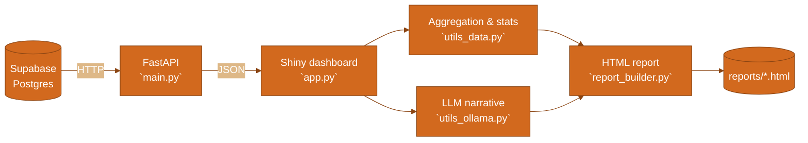

# 📄 Traffic-Predictor

Analyze how different **event categories** (e.g., *Sport & cultural*) relate to **traffic congestion**, then generate a shareable **HTML report** with charts and a short narrative summary.

## 📑 Table of Contents

- [📊 Overview](#-overview)
- [🏗️ System architecture](#️-system-architecture)
- [🧰 Installation](#-installation)
- [▶️ How to run](#️-how-to-run)
- [🔑 API requirements (keys & .env)](#-api-requirements-keys--env)
- [🗃️ Database schema & data structure](#️-database-schema--data-structure)
- [🧭 Usage guide](#-usage-guide)
- [🖼️ Screenshots](#️-screenshots)
- [🔗 Documentation & code reference](#-documentation--code-reference)

## 📊 Overview

- **Inputs**: traffic records + event records stored in **Supabase** (Postgres).
- **UI**: a Shiny dashboard where you choose **Event type**, **Time window**, and optional **Years**.
- **Why an AI-powered report?** The app generates an **AI-assisted narrative** that turns the computed statistics into a short, reader-friendly explanation (what’s high/low, what changed vs baseline) plus actionable guidance for travel planning.
- **Output**: a report with:
  - **Event impact ranking** (avg congestion + % change vs baseline)
  - optional **Time-based impact** (only when time window = **full day**)
  - suggested actions and a short methodology appendix
  - a **summary section shown directly in the dashboard UI**, plus a downloadable full HTML report

## 🏗️ System architecture



1. **Store data** in Supabase tables (`traffic`, `event`) using the schema in [supabase_migration_traffic_event.sql](./supabase_migration_traffic_event.sql).
2. **Serve data** with FastAPI ([main.py](./main.py)), which reads from Supabase via [database.py](./database.py).
3. **Interact in the UI** ([app.py](./app.py)): choose event type, time window, and (optionally) years.
4. **Compute analysis** ([utils_data.py](./utils_data.py)): match traffic rows to event windows, compute baseline vs event-window averages, percent change, rankings, and an optional two-sample t-test.
5. **(Optional) Generate narrative** ([utils_ollama.py](./utils_ollama.py)): send the aggregated stats and ranked lists to an LLM so the narrative ordering matches the charts.
6. **Render the report** ([report_builder.py](./report_builder.py)) into `reports/*.html`.

### 🤖 AI model & how analysis is produced

- **Model**: by default, [utils_ollama.py](./utils_ollama.py) calls **Ollama Cloud** using `model="gpt-oss:20b-cloud"`.
- **What the AI sees**: the prompt includes aggregated statistics (window average, baseline average, percent change, counts) plus **explicit ranked lists** (top event names by average congestion and by % change) so the narrative matches the plotted order.
- **Fallback behavior**: if `OLLAMA_API_KEY` is missing or the call fails, the report still generates with charts and statistics; the AI narrative sections may be blank and the appendix notes that narrative was unavailable.

## 🧰 Installation

```bash
cd Traffic-Predictor
python -m venv .venv
source .venv/bin/activate
pip install -r requirements.txt
```

## ▶️ How to run

### 🖥️ Run locally (developer setup)

You need **two terminals** (API + dashboard) and one browser tab.

1. **Start the API (FastAPI)**

   ```bash
   cd Traffic-Predictor
   uvicorn main:app --reload
   ```

2. **Start the dashboard (Shiny)**

   ```bash
   cd Traffic-Predictor
   python app.py
   ```

3. **Open the app locally**

   - Go to `http://127.0.0.1:8001`

### 🌐 Use the hosted app (public URL)

The same dashboard is deployed at:

- `https://traffic-predictor-suwfj.ondigitalocean.app/`

From there you can run new analyses without setting up Python locally. The hosted dashboard talks to the FastAPI and Supabase in the background.

### 🌐 DigitalOcean App Platform (two-component setup)

When deploying to DigitalOcean App Platform, use **two components** in the same App:

1. **API component (FastAPI)**
   - **Run command**

     ```bash
     uvicorn main:app --host 0.0.0.0 --port 8000
     ```

   - **Spec hint (YAML)**: expose the internal port

     ```yaml
     services:
       - name: traffic-predictor-api
         internal_ports:
           - 8000
     ```

   - **Env vars**
     - `SUPABASE_URL`
     - `SUPABASE_KEY`

2. **Dashboard component (Shiny app)**
   - **Run command**

     ```bash
     python app.py
     ```

   - **Env vars**
     - `API_BASE_URL` = `http://traffic-predictor-api:8000` (internal DNS name from the API component’s `name`)
     - `OLLAMA_API_KEY` (optional, for AI narrative)

DigitalOcean injects `PORT` for the public web component; `app.py` reads it and binds to `0.0.0.0:$PORT` automatically.

## 🔑 API requirements (keys & .env)

Create `Traffic-Predictor/.env` with:

- **`SUPABASE_URL`**: your Supabase project URL
- **`SUPABASE_KEY`**: a Supabase API key (service role recommended for full read access in dev)
- **`API_BASE_URL`** (optional): defaults to `http://127.0.0.1:8000`
- **`OLLAMA_API_KEY`**: required if you want the AI narrative section (charts + stats still work without it)

Setup details: [SUPABASE_SETUP.md](./SUPABASE_SETUP.md)

## 🗃️ Database schema & data structure

Tables are created by:
- [supabase_migration_traffic_event.sql](./supabase_migration_traffic_event.sql)
- [supabase_migration_add_event_duration.sql](./supabase_migration_add_event_duration.sql)

### `traffic`

| column | type | notes |
|---|---|---|
| `id` | bigint | primary key |
| `location_id` | int | join key |
| `traffic_timestamp` | timestamptz | timestamp of measurement |
| `traffic_date` | date | used for full-day matching |
| `congestion_level` | int | 1–10 |

### `event`

| column | type | notes |
|---|---|---|
| `id` | bigint | primary key |
| `location_id` | int | join key |
| `event_type` | text | category (e.g., Sport & cultural) |
| `event_name` | text | event label/title |
| `event_date` | date | used for full-day matching |
| `event_timestamp` | timestamptz | anchor for time windows |
| `event_duration` | int | minutes (default 60) |

Codebook for CSVs and variables: [docs/CODEBOOK.md](./docs/CODEBOOK.md)

## 🧭 Usage guide

1. Select **Event type**.
2. Select **Time window**:
   - **full day**: compares all traffic on the same (location_id, date) as events vs baseline
   - other windows (e.g. **1h before**): compares traffic in the window around each event timestamp vs baseline
3. Choose **All time** or **Specific years**.
4. Click **Generate Report**.
   - The **Summary** from the AI-generated report appears directly in the dashboard once the run finishes.
   - Click **“Click here to see the full report”** to download the full detailed HTML (charts, event impact section, optional time-based impact, suggested actions, and methodology appendix). Locally, that HTML is also written to `Traffic-Predictor/reports/traffic_report_YYYYMMDD_HHMMSS.html`.

## 🖼️ Screenshots


## 🔗 Documentation & code reference

If you’re new to the repo, a good reading order is: **schema → API → dashboard → aggregation → report builder**.

### 🧭 Repo navigation (where to look)

| What you want | Start here |
|---|---|
| Database schema (tables + indexes) | [supabase_migration_traffic_event.sql](./supabase_migration_traffic_event.sql) |
| Supabase setup + loading walkthrough | [SUPABASE_SETUP.md](./SUPABASE_SETUP.md) |
| Generate synthetic CSV data (fully reproducible) | [generate_fake_data.py](./generate_fake_data.py) |
| Load `traffic.csv` / `event.csv` into Supabase | [load_data_to_supabase.py](./load_data_to_supabase.py) |
| FastAPI endpoints (`/traffic`, `/events`, `/reports/*`) | [main.py](./main.py) |
| Supabase client + `.env` keys | [database.py](./database.py) |
| Shiny dashboard UI + prompt building | [app.py](./app.py) |
| Matching logic + stats + t-test payload | [utils_data.py](./utils_data.py) |
| LLM call (Ollama Cloud) | [utils_ollama.py](./utils_ollama.py) |
| HTML report assembly + Plotly charts | [report_builder.py](./report_builder.py) |

### 📚 Deeper docs

- **API** (endpoints, params, examples): [docs/API.md](./docs/API.md)
- **Function reference** (inputs, parameters, outputs): [docs/REFERENCE.md](./docs/REFERENCE.md)
- **Pipeline guide** (reproduce end-to-end): [docs/PIPELINE.md](./docs/PIPELINE.md)
- **Codebook** (variables + join/time-window notes): [docs/CODEBOOK.md](./docs/CODEBOOK.md)
- **Workflow diagram** (original): [workflow-diagram.md](./workflow-diagram.md)
