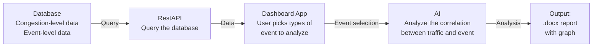

# Workflow Diagram

This diagram defines the goal and architecture of the Traffic-Predictor tool.

## Pipeline summary

| Stage       | Role |
|------------|------|
| **Database**   | Stores congestion-level and event-level data. |
| **RestAPI**    | Queries the database and exposes data. |
| **Dashboard App** | Lets users choose event types to analyze. |
| **AI**         | Analyzes correlation between traffic and events. |
| **Output**     | Produces a .docx report with graphs. |
