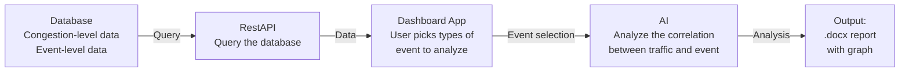

# Workflow Diagram

```mermaid
flowchart LR
    Database["Database<br/>Congestion-level data<br/>Event-level data"]
    RestAPI["RestAPI<br/>Query the database"]
    DashboardApp["Dashboard App<br/>User picks types of<br/>event to analyze"]
    AI["AI<br/>Analyze the correlation<br/>between traffic and event"]
    Output["Output:<br/>.docx report<br/>with graph"]
    
    Database -->|Query| RestAPI
    RestAPI -->|Data| DashboardApp
    DashboardApp -->|Event selection| AI
    AI -->|Analysis| Output
```